# FC 大字体中文菜单解决方案

### 1.编辑标题名

打开 text/text_title.txt 编辑标题文本内容

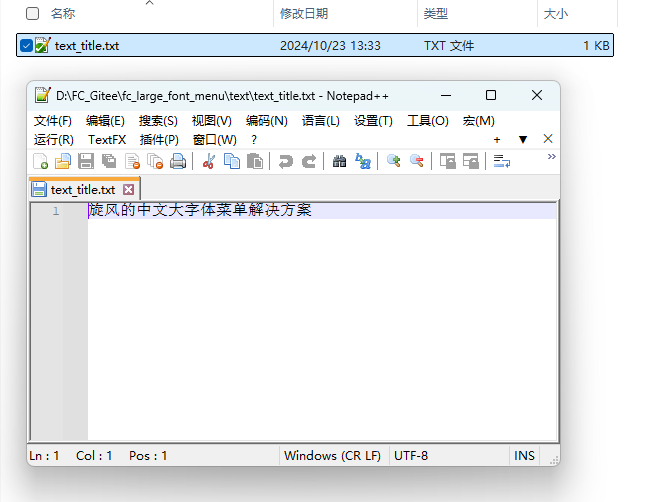

### 2.编辑字体

依次如下可执行文件, 编辑字体

FC_Font_Tool_Title.exe 标题文本

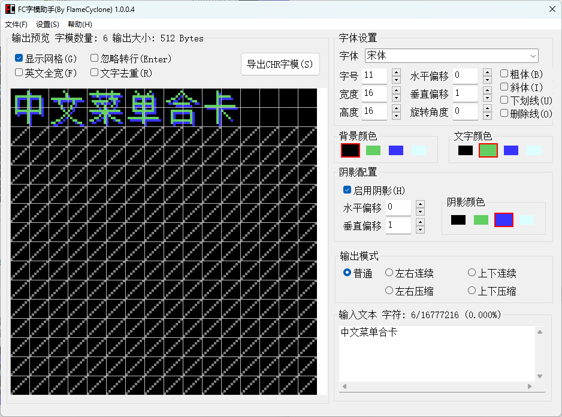

FC_Font_Tool_English.exe 英文字体

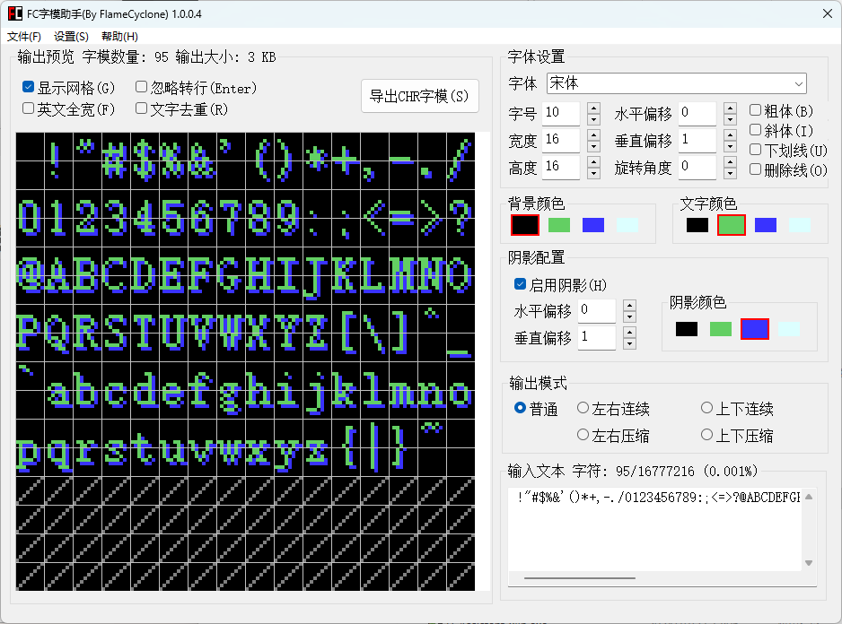

FC_Font_Tool_List.exe 节目名文本

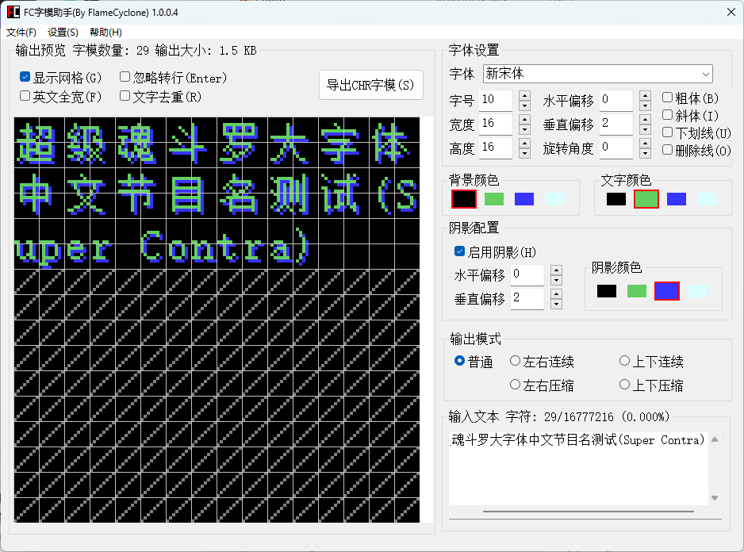

### 3.配置外部菜单

打开 FCAssistant_x86.exe, 设置->外部菜单->配置

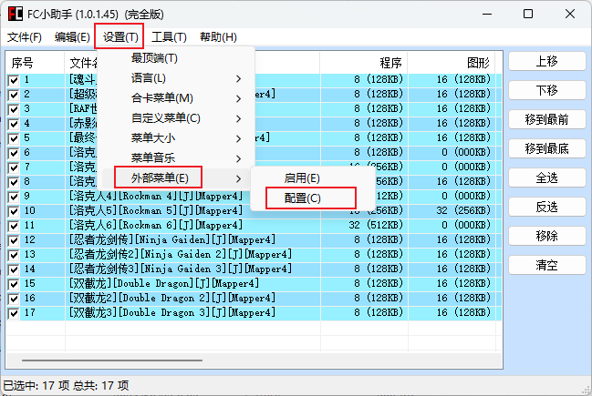

菜单路径选择当前文件夹下的 fc_basic_main.asm

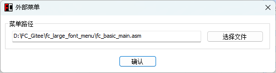

点击 设置->外部菜单 将启用勾选

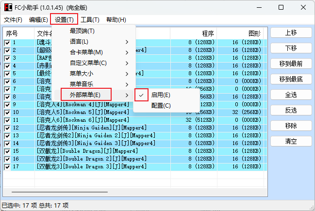

### 3.节目列表编辑

将需要合并的节目添加到列表

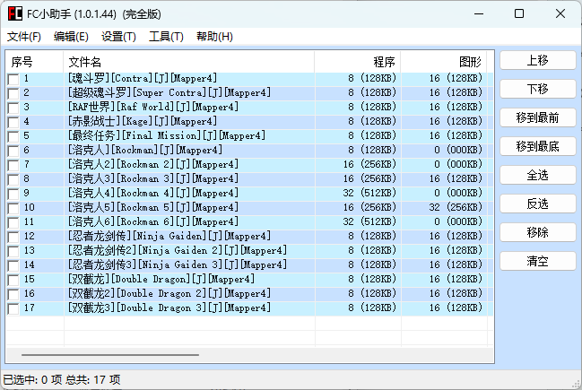

双击文件名修改节目名

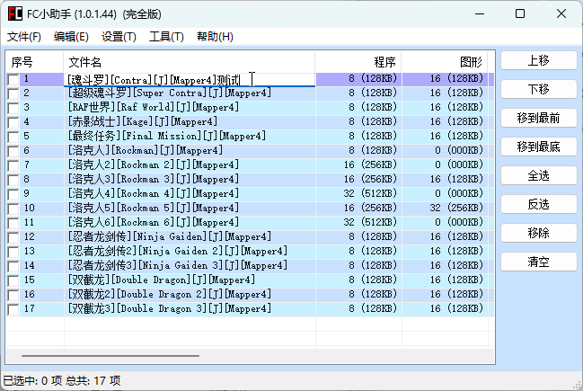

### 4.生成合卡ROM

勾选上要合并的节目

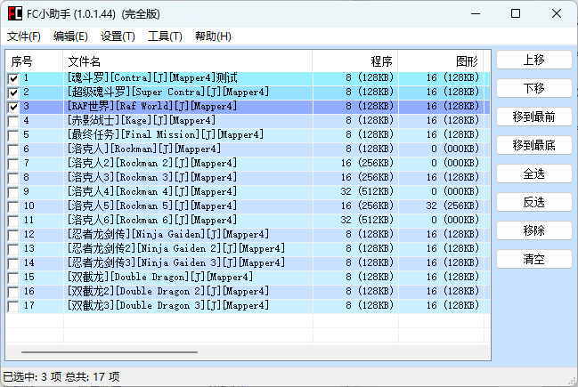

点击菜单项的 编辑 选择想生成的ROM

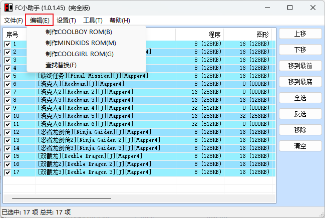

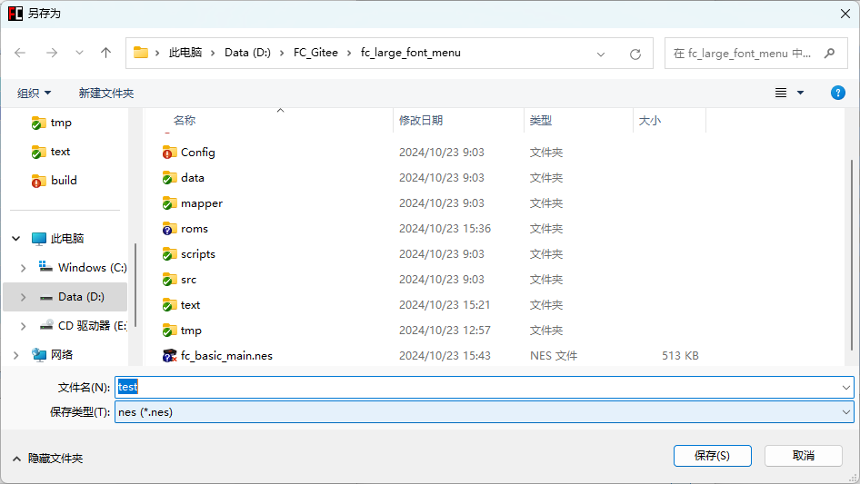

### 5.预览ROM效果

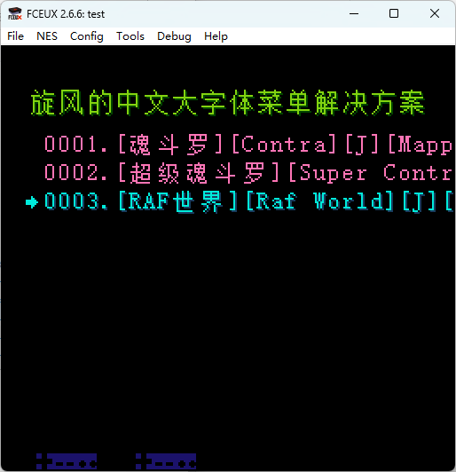
